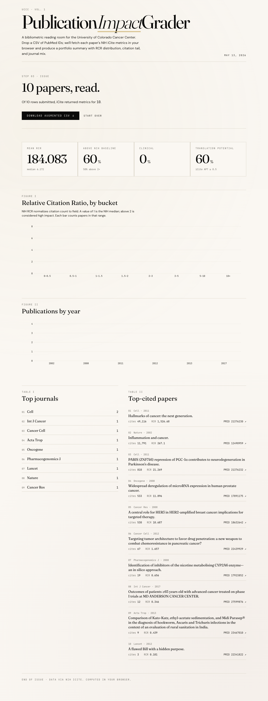
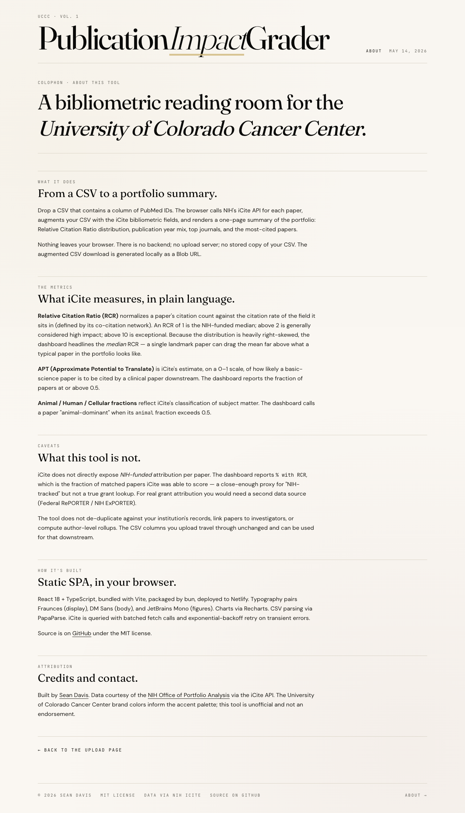

# UCCC Publication Impact Grader

A static web app for the University of Colorado Cancer Center. Drop a CSV of PubMed IDs; the browser calls NIH's [iCite API](https://icite.od.nih.gov/api) for each paper, then renders a one-page editorial-styled dashboard (RCR distribution, year histogram, top journals, top-cited papers) and lets you download the augmented CSV.

The entire app runs in the browser — there is no backend. iCite enables CORS for cross-origin browser requests.

<p align="center">
  
  <br><em>Upload page.</em>
</p>
<p align="center">
  
  <br><em>Summary dashboard after a 10-PMID portfolio is processed.</em>
</p>
<p align="center">
  
  <br><em>About page (methodology and credits).</em>
</p>

## Quickstart

```bash
just install   # bun install in ./frontend
just dev       # Vite dev server on http://localhost:5173
just test      # vitest
just build     # static SPA in frontend/dist
```

`just --list` enumerates the rest.

## Configuration

`.env` (gitignored) sets a single env var consumed at build time:

```
VITE_GA_MEASUREMENT_ID=G-XXXXXXXXXX   # leave empty to disable analytics
```

In production, this is supplied via Docker build arg / GCP Secret Manager.

## CSV format

Any CSV with a column of PubMed IDs. The PMID column name is auto-detected case-insensitively (default `pmid`); override it from the upload page if your column is called something else (e.g. `pubmed_id`). Original columns and row order are preserved; iCite columns are appended. If an iCite field name collides with one of your column names (e.g. you already have a `year`), the iCite version is renamed with an `icite_` prefix so your data is untouched.

## Deployment

Deployed to [Netlify](https://www.netlify.com/). Build settings live in [`netlify.toml`](./netlify.toml); custom domain + CNAME are configured in the Netlify UI. `VITE_GA_MEASUREMENT_ID` is set as a Netlify environment variable for production builds.

[](https://app.netlify.com/start/deploy?repository=https://github.com/seandavi/uccc-pubmed-grader)

## Architecture

```
upload → parseCSV (papaparse) → validPmids
       → fetchMany (iCite, batched, with retry)
       → computeSummary (RCR, year, journals, top cited)
       → writeAugmentedCSV → Blob URL → download
```

- `frontend/src/lib/icite.ts` — async generator batching PMIDs (default 200/call), retries 429/5xx with exponential backoff.
- `frontend/src/lib/csv.ts` — parse + augment, collision-safe iCite column rename.
- `frontend/src/lib/stats.ts` — pure dashboard-summary computation.
- `frontend/src/hooks/useGrading.ts` — orchestrates the flow + drives progress state for the UI.
- `frontend/src/components/` — editorial UI (Fraunces / DM Sans / JetBrains Mono, cream paper + ink + CU gold).

## Why client-only?

For "read a CSV, call a public API for each row, render stats, give the file back," a backend buys you very little and costs you operational complexity. We're trading that complexity for: no infra to run, no auth, no rate-limit proxy, no file storage, no shareable job URLs. If any of those needs surface later, a backend can be added back — but starting here keeps the surface small.

## Credits

Built by [Sean Davis](mailto:seandavi@gmail.com). Bibliometric data courtesy of the [NIH Office of Portfolio Analysis](https://icite.od.nih.gov/) via the iCite API. UCCC brand colors inform the accent palette; this tool is unofficial.

## License

MIT.
